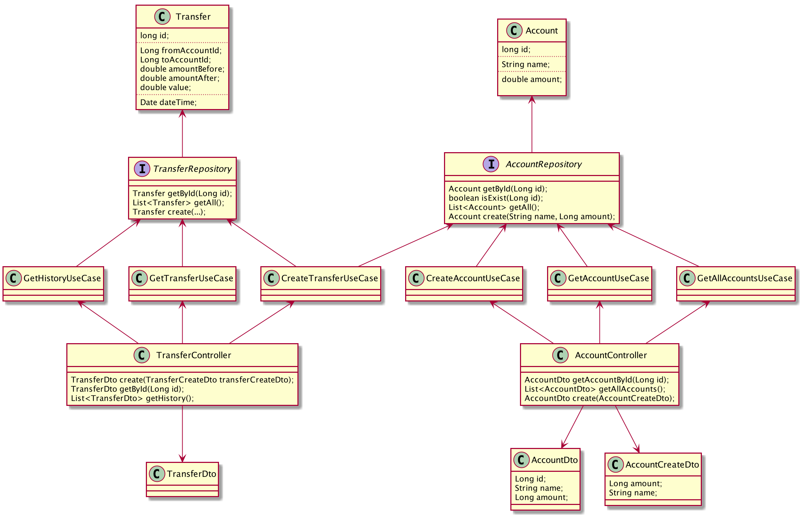
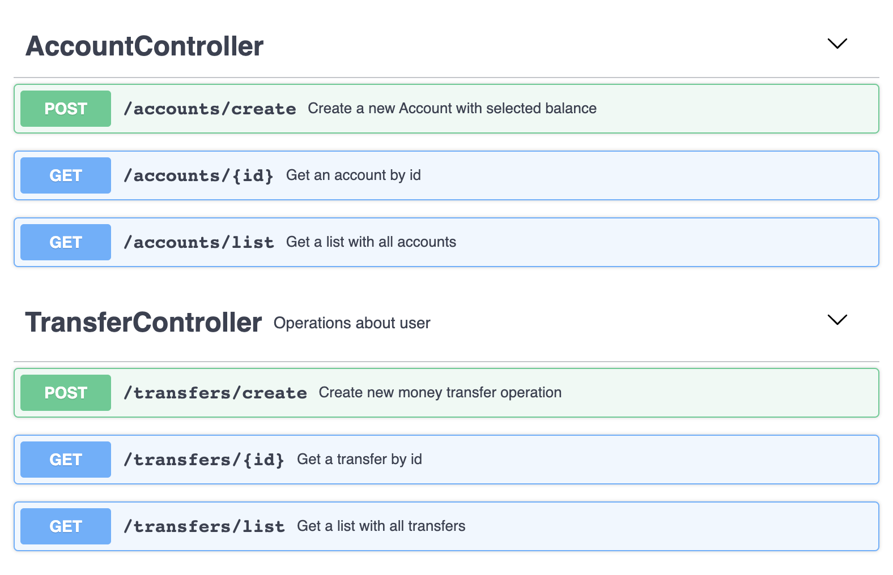

# Account management system API

image:https://travis-ci.com/antkorwin/account-management-test.svg?branch=master["Build Status", link="https://travis-ci.com/antkorwin/account-management-test"]
image:https://codecov.io/gh/antkorwin/account-management-test/branch/master/graph/badge.svg[link ="https://codecov.io/gh/antkorwin/account-management-test"]

## UML

classes diagram:

### The list of technologies

- google guice
- undertow web server
- lombok
- mapstruct
- junit5
- mockito
- assertj
- rest assured

### My own libraries
- xsync
- stress-test

## API

- create new account

[source]
----
> curl -XPOST 127.0.0.1:8080/accounts/create -d '{"name":"first","balance":1000}'

{
    "id" : 1,
    "name" : "first",
    "balance" : 1000
}

> curl -XPOST 127.0.0.1:8080/accounts/create -d '{"name":"second","balance":100}'

{
    "id" : 1,
    "name" : "second",
    "balance" : 100
}
----

- get an account by id
[source]
----
> curl 127.0.0.1:8080/accounts/1

{
    "id" : 1,
    "name" : "first",
    "balance" : 1000
}
----

- get a list with all accounts
[source]
----
> curl 127.0.0.1:8080/accounts/list

[
   {
      "balance" : 1000,
      "id" : 1,
      "name" : "first"
   },
   {
      "balance" : 100,
      "id" : 2,
      "name" : "second"
   }
]
----

- create money transfer from the first account to the second
[source]
----
> curl -XPOST 127.0.0.1:8080/transfers/create -d '{"fromAccountId":1,"toAccountId":2,"value":1000}'

{
   "id" : 1,
   "fromAccountId" : 1,
   "toAccountId" : 2,
   "value" : 1000,
   "dateTime" : 1577949064878
}
----

- get the transfer entity by id
[source]
----
> curl 127.0.0.1:8080/transfers/1

{
   "id" : 1,
   "fromAccountId" : 1,
   "toAccountId" : 2,
   "value" : 1000,
   "dateTime" : 1577949064878
}
----

- get a list with all transfers
[source]
----
> curl 127.0.0.1:8080/transfers/list

[
   {
      "id" : 1,
      "fromAccountId" : 1,
      "dateTime" : 1577949064878,
      "value" : 1000,
      "toAccountId" : 2
   },
   {
      "dateTime" : 1577949246196,
      "value" : 700,
      "toAccountId" : 1,
      "id" : 2,
      "fromAccountId" : 2
   }
]

----

