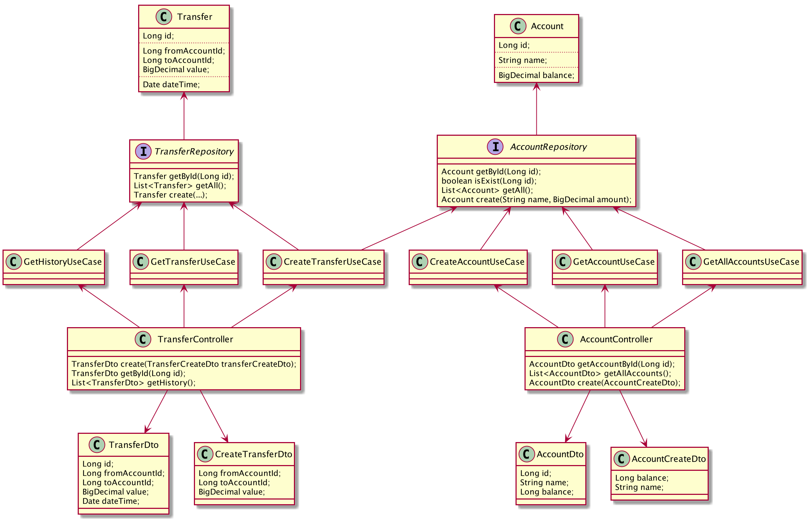

# Account management system API

image:https://travis-ci.com/antkorwin/account-management-test.svg?branch=master["Build Status", link="https://travis-ci.com/antkorwin/account-management-test"]
image:https://codecov.io/gh/antkorwin/account-management-test/branch/master/graph/badge.svg[link ="https://codecov.io/gh/antkorwin/account-management-test"]

## UML

classes diagram:

### The list of technologies

- link:https://github.com/google/guice[Google Guice]
- link:https://github.com/undertow-io/undertow[Undertow WebServer]
- link:https://projectlombok.org/[Lombok]
- link:https://mapstruct.org/[MapStruct]
- link:https://github.com/junit-team/junit5[JUnit5]
- link:https://site.mockito.org/[Mockito]
- link:https://joel-costigliola.github.io/assertj/[AssertJ]
- link:http://rest-assured.io/[Rest-Assured]

### My own libraries
- link:https://github.com/antkorwin/xsync[XSync]
- link:https://github.com/jupiter-tools/stress-test[StressTest]

### CI
- link:https://travis-ci.com/antkorwin/account-management-test[Travis-CI]
- link:https://codecov.io/gh/antkorwin/account-management-test[CodeCov]

## API

- create new account

[source]
----
> curl -XPOST 127.0.0.1:8080/accounts/create -d '{"name":"first","balance":1000}'

// status-code: 201

{
    "id" : 1,
    "name" : "first",
    "balance" : 1000
}

> curl -XPOST 127.0.0.1:8080/accounts/create -d '{"name":"second","balance":100}'

// status-code: 201

{
    "id" : 1,
    "name" : "second",
    "balance" : 100
}
----

- get an account by id
[source]
----
> curl 127.0.0.1:8080/accounts/1

// status-code: 200

{
    "id" : 1,
    "name" : "first",
    "balance" : 1000
}
----

- get a list with all accounts
[source]
----
> curl 127.0.0.1:8080/accounts/list

// status-code: 200

[
   {
      "balance" : 1000,
      "id" : 1,
      "name" : "first"
   },
   {
      "balance" : 100,
      "id" : 2,
      "name" : "second"
   }
]
----

- create money transfer from the first account to the second
[source]
----
> curl -XPOST 127.0.0.1:8080/transfers/create -d '{"fromAccountId":1,"toAccountId":2,"value":1000}'

// status-code: 201

{
   "id" : 1,
   "fromAccountId" : 1,
   "toAccountId" : 2,
   "value" : 1000,
   "dateTime" : 1577949064878
}
----

- get the transfer entity by id
[source]
----
> curl 127.0.0.1:8080/transfers/1

// status-code: 200

{
   "id" : 1,
   "fromAccountId" : 1,
   "toAccountId" : 2,
   "value" : 1000,
   "dateTime" : 1577949064878
}
----

- get a list with all transfers
[source]
----
> curl 127.0.0.1:8080/transfers/list

// status-code: 200

[
   {
      "id" : 1,
      "fromAccountId" : 1,
      "dateTime" : 1577949064878,
      "value" : 1000,
      "toAccountId" : 2
   },
   {
      "dateTime" : 1577949246196,
      "value" : 700,
      "toAccountId" : 1,
      "id" : 2,
      "fromAccountId" : 2
   }
]

----

- example of the error handling
[source]
----
> curl -XPOST 127.0.0.1:8080/transfers/create -d '{"fromAccountId":1,"toAccountId":2,"value":99999}'

// status-code: 500

{
   "message" : "There is not enough money on the source account balance."
}
----

## How to Build

[source]
----
> mvn clean package

...

[INFO] -------------------------------------------
[INFO] BUILD SUCCESS
[INFO] -------------------------------------------
[INFO] Total time:  17.450 s
[INFO] Finished at: 2020-01-02T19:56:02+10:00
[INFO] -------------------------------------------
----

## How to Run

[source]
----
> java -jar ./target/account-management-test-1.0-SNAPSHOT-jar-with-dependencies.jar

...

[XNIO-1 I/O-11] DEBUG org.xnio.nio - Started channel thread 'XNIO-1 I/O-11'
[XNIO-1 I/O-12] DEBUG org.xnio.nio - Started channel thread 'XNIO-1 I/O-12'
[XNIO-1 Accept] DEBUG org.xnio.nio - Started channel thread 'XNIO-1 Accept'
[main] DEBUG io.undertow - Configuring listener with protocol HTTP for interface localhost and port 8080
[main] INFO account.management.system.webserver.WebServer -
---------------------------------------------------------
   __
   \ \_____
###[==_____>             Successfully start web server
   /_/      __           io.undertow.Undertow@6404f418
            \ \_____     at http://127.0.0.1:8080
         ###[==_____>
            /_/
---------------------------------------------------------

----

